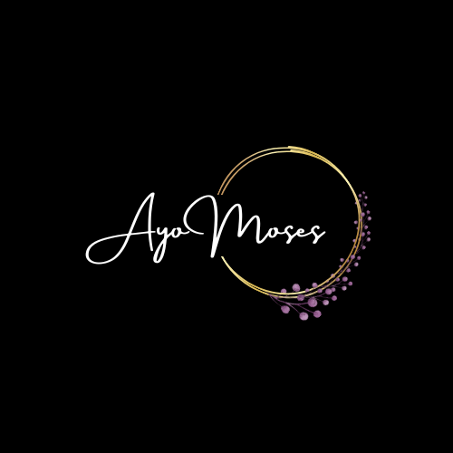

<a name="readme-top"></a>

<div align="center">

  
  <br/>

  <h3><b>My Todolist App</b></h3>

</div>

# 📗 Table of Contents

- [📖 About the Project](#about-project)
  - [🛠 Built With](#built-with)
    - [Tech Stack](#tech-stack)
    - [Key Features](#key-features)
  - [🚀 Live Demo](#live-demo)
- [💻 Getting Started](#getting-started)
  - [Setup](#setup)
  - [Prerequisites](#prerequisites)
  - [Install](#install)
  - [Usage](#usage)
  - [Run tests](#run-tests)
  - [Deployment](#triangular_flag_on_post-deployment)
- [👥 Authors](#authors)
- [🔭 Future Features](#future-features)
- [🤝 Contributing](#contributing)
- [⭐️ Show your support](#support)
- [🙏 Acknowledgements](#acknowledgements)
- [❓ FAQ](#faq)
- [📝 License](#license)

# 📖 Todolist App<a name="about-project"></a>

**Shachah** is one of the interesting projects I have had to work on as a developer. This project was developed to enhance my es6 implementation skills.
## 🛠 Built With <a name="built-with"> Html and CSS</a>

### Tech Stack <a name="tech-stack"></a>

<details>
  <summary>Frontend</summary>
  <ul>
    <li>Html</li>
    <li>CSS</li>
    <li>JavaScript</li>
  </ul>
</details>


### Key Features <a name="key-features"></a>

- **Deleting a todo item**
- **Adding a todo Item**
- **Localstorage Integration**

<p align="right">(<a href="#readme-top">back to top</a>)</p>


## 🚀 Live Demo <a name="https://ayomoses1.github.io/todolist/dist"></a>


<p align="right">(<a href="#readme-top">back to top</a>)</p>


## 💻 Getting Started <a name="getting-started"></a>

To get a local copy up and running, follow these steps.

### Prerequisites

In order to run this project you need:


```sh
 npm install webpack webpack-cli webpack-dev-server
```


### Setup

Clone this repository to your desired folder:


```sh
  cd todolist
  git clone https://github.com/AyoMoses1/todolist.git
```

### Install

Install this project with:


```sh
  cd todolist
  node version 16
```


### Usage

To run the project, execute the following command:


```
  npm start
```

### Deployment

You can deploy this project using:

- GitHub Pages
- Netlify
- Heroku
- Cyclic


<p align="right">(<a href="#readme-top">back to top</a>)</p>

## 👥 Authors <a name="authors"></a>

👤 **Author**

- GitHub: [@AyoMoses1](https://github.com/AyoMoses1)
- Twitter: [@Ayo_Moses1](https://twitter.com/Ayo_Moses1)
- LinkedIn: [Ayo Moses](https://www.linkedin.com/in/ayo-moses-493946184/)


<p align="right">(<a href="#readme-top">back to top</a>)</p>


## 🔭 Future Features <a name="future-features"></a>

- **Responsive Application**
- **Local storage Integration**
- **Github Deployment**

<p align="right">(<a href="#readme-top">back to top</a>)</p>


## 🤝 Contributing <a name="contributing"></a>

Contributions, issues, and feature requests are welcome!

Feel free to check the [issues page](../../issues/).

<p align="right">(<a href="#readme-top">back to top</a>)</p>


## ⭐️ Show your support <a name="support"></a>

If you like this project, please support by contributing to the codebase

<p align="right">(<a href="#readme-top">back to top</a>)</p>

## 🙏 Acknowledgments <a name="acknowledgements"></a>

I would like to thank the entire microverse team for the inspiration h=behinf this project.

<p align="right">(<a href="#readme-top">back to top</a>)</p>

## ❓ FAQ <a name="faq"></a>

- **Will there be a desktop version of this project**

  - Yes, there will certainly be a desktop version to aid desktop users in having a friendly UX experience on the website


<p align="right">(<a href="#readme-top">back to top</a>)</p>


## 📝 License <a name="license"></a>

This project is [MIT](./LICENSE.md) licensed.


<p align="right">(<a href="#readme-top">back to top</a>)</p>